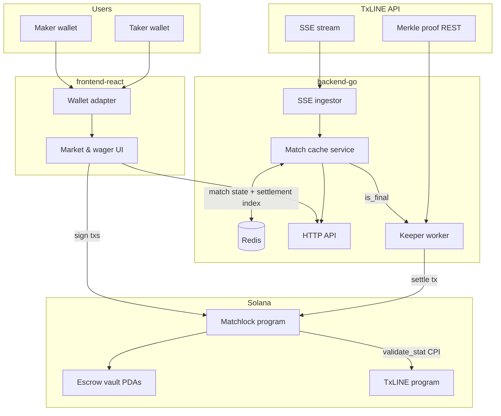

# Matchlock — Production Engineering Plan

**TxLINE Prediction Platform** · Solana · Go · React

This document is the authoritative engineering roadmap for Matchlock: a decentralized sports wagering platform settled against [TxLINE](https://txline.txodds.com/documentation/quickstart) consensus data. Every phase ships **production-grade** software — no proofs of concept, no placeholder bots, no mocked settlement paths.

---

## 1. Product vision

Matchlock lets users wager USDT on sports outcomes. Wagers are escrowed on Solana, matched peer-to-peer or against shared liquidity pools, and settled trustlessly when TxLINE finalizes match statistics and supplies cryptographic proofs.

| Property | Requirement |
|----------|-------------|
| Custody | User funds never leave program-controlled vaults until cancel or verified settlement |
| Resolution | On-chain settlement only after TxLINE `validate_stat` CPI succeeds |
| Transparency | Every settled market exposes verifiable Merkle proof artifacts in transaction logs |
| Operability | Keeper, backend, and frontend run continuously with reconnect, idempotency, and RPC failover |

---

## 2. Engineering principles

1. **Complete vertical slices** — Each phase delivers an end-to-end user journey, not isolated layer stubs.
2. **Fail closed** — Invalid proofs, wrong signers, or bad state transitions revert; never partial payout.
3. **Idempotent automation** — Keeper treats duplicate `is_final` events and on-chain "already settled" as success.
4. **Simulate before sign** — Frontend and keeper simulate every transaction before submission.
5. **Network consistency** — devnet RPC, program ID, and `txline-dev.txodds.com` (or mainnet equivalents) are enforced at startup; mixing networks is a hard error.
6. **Test gates** — No phase is complete until automated tests and a documented devnet smoke run pass.

---

## 3. Repository layout

```
matchlock/
├── blockchain/                 # Anchor program (escrow, pools, TxLINE CPI)
│   └── programs/blockchain/
├── backend-go/                 # SSE ingest, Redis cache, keeper, HTTP API
├── frontend-react/             # Wallet UX, markets, receipts, leaderboard
└── docs/
    ├── plan.md                 # This file
    └── integration-journal.md  # Living integration log
```

| Layer | Owns |
|-------|------|
| `blockchain/` | Account layouts, token flows, PDA seeds, TxLINE CPI, settlement logic, structured logs |
| `backend-go/` | TxLINE auth/SSE, Redis match cache, keeper transaction submission, REST/SSE to frontend |
| `frontend-react/` | Wallet connection, transaction building, confirmation UX, charts, receipts |

---

## 4. System architecture



**Data flow (wager lifecycle):**

1. Maker calls `make_wager` → USDT locked in vault PDA.
2. Taker calls `accept_wager` → matching stake locked; status `Matched`.
3. Maker may call `cancel_wager` while status is `Open` → full maker refund.
4. On TxLINE `is_final`, keeper fetches Merkle proof and submits `settle_wager`.
5. Program CPIs TxLINE `validate_stat`; on success, pays winner and closes accounts.

### 4.1 Redis cache (Phase 1 backend)

Matchlock uses **Redis** as the shared, durable cache between SSE ingest, the HTTP API, and the keeper worker.

| Key pattern | Purpose | TTL |
|-------------|---------|-----|
| `matchlock:match:{match_id}` | Latest match snapshot (`is_final`, scores, seq) | none |
| `matchlock:matches` | Set of known `match_id` values for `GET /matches` | none |
| `matchlock:final:{match_id}` | `SET NX` — first final event only (keeper idempotency) | 7 days |
| `matchlock:settled:{match_id}:{wager}` | Settlement tx sig after successful `settle_wager` | 30 days |

**Why Redis:** multiple backend processes can share state; settlement dedupe survives restarts; API reads do not hit TxLINE SSE or Solana RPC directly.

**Env:** `REDIS_URL` (default `redis://127.0.0.1:6379/0`).

### 4.2 TxLINE tokens vs wager collateral

TxLINE exposes **two distinct on-chain tokens** on devnet. They must not be conflated.

| Token | Devnet mint | Role | Who uses it |
|-------|-------------|------|-------------|
| **TxLINE credit token** | `4Zao8ocPhmMgq7PdsYWyxvqySMGx7xb9cMftPMkEokRG` | Data-authorization / API subscription (`subscribe` → `X-Api-Token`) | Backend operator only (`activate-txline`) |
| **Wager stablecoin** | `ELWTKspHKCnCfCiCiqYw1EDH77k8VCP74dK9qytG2Ujh` | P2P escrow stakes in Matchlock vault PDAs | Makers and takers |

**TxLINE architectural rule:** the internal credit token is locked to the TxLINE program for data authorization. It **must not** be used for peer-to-peer staking, wagering pools, or wallet transfers between contestants.

**Matchlock compliance:**

1. **Escrow** — `Config.stablecoin_mint` pins a separate SPL stablecoin (devnet USDT; mainnet USDC). User stakes flow only through Matchlock vault PDAs (`make_wager`, `accept_wager`, `cancel_wager`, `settle_wager`).
2. **Settlement** — TxLINE `validate_stat` CPI verifies match data; it does not move credit tokens or substitute for wager collateral.
3. **API access** — Keeper/backend wallet pays the credit-token subscription; end-user wallets never hold or transfer TxLINE credits.
4. **Phase 2 pools** — LP liquidity and swaps use the same wager stablecoin mint, never the credit token.

**Devnet faucet:** `request_devnet_faucet` on the TxLINE program mints test USDT from `usdt_treasury` for hackathon flows (`smoke-wager`, etc.). This is test stake liquidity, not the credit subscription token.

**Mainnet:** pin Circle (or equivalent) USDC in `Config`; keep TxLINE credit subscription on the operator wallet only.

---

## 5. Cross-cutting requirements

Apply to **every** phase before marking work complete.

### 5.1 On-chain security checklist

- [ ] Typed `Account` deserialization with owner checks on every account
- [ ] Explicit signers for maker, taker, and authority actions
- [ ] PDA seeds defined in `constants.rs`; vault accounts constrained by seeds + stored bumps
- [ ] `TransferChecked` only (mint + decimals); USDT mint pinned via config PDA
- [ ] Checked arithmetic on all token amounts
- [ ] Status enum enforces valid transitions; settled/cancelled wagers are terminal
- [ ] No unconstrained `UncheckedAccount` without documented constraints
- [ ] Settlement CPI targets hardcoded TxLINE program ID
- [ ] Structured `msg!` / events for receipt parsing (Merkle root, path length, winner)

### 5.2 Testing gates

| Layer | Minimum bar |
|-------|-------------|
| `blockchain/` | LiteSVM tests per instruction: happy path + unauthorized signer + invalid state; `anchor build` + `cargo test` green |
| `backend-go/` | Table-driven unit tests; httptest for API handlers; race-detector run on CI |
| `frontend-react/` | Component tests for wager forms; integration test against devnet + local API |

### 5.3 Configuration & environments

| Environment | Solana cluster | TxLINE origin | Purpose |
|-------------|----------------|---------------|---------|
| Local | localnet / Surfpool | dev origin or fixture | Program + keeper development |
| Staging | devnet | `https://txline-dev.txodds.com` | Integration & demo |
| Production | mainnet-beta | `https://txline.txodds.com` | Live deployment (explicit approval required) |

Config must validate cluster ↔ TxLINE origin ↔ USDC mint at process start.

### 5.4 Observability

- Structured logging in Go (match_id, wager pubkey, tx signature, keeper action)
- Program logs for state transitions and settlement artifacts
- Health endpoints: `/healthz`, `/readyz` on backend

---

## 6. On-chain account model (reference)

### 6.1 `Config` (singleton PDA)

| Field | Type | Notes |
|-------|------|-------|
| `authority` | `Pubkey` | Upgrade/admin; multisig on mainnet |
| `usdt_mint` | `Pubkey` | Environment-specific USDT mint |
| `txline_program` | `Pubkey` | TxLINE program ID for CPI |
| `bump` | `u8` | Config PDA bump |

### 6.2 `Wager`

| Field | Type | Notes |
|-------|------|-------|
| `maker` | `Pubkey` | Creates the wager |
| `taker` | `Pubkey` | `Pubkey::default()` until accepted |
| `match_id` | `[u8; 32]` | TxLINE match identifier (variable length stored in `match_id_len`) |
| `match_id_len` | `u8` | 1–32 |
| `maker_side` | `Side` | Outcome the maker backs (e.g. Home, Away, Over) |
| `stake_amount` | `u64` | USDT base units per party |
| `status` | `WagerStatus` | See state machine below |
| `bump` | `u8` | Wager PDA bump |
| `vault_bump` | `u8` | Vault PDA bump |

**PDA seeds**

```
wager: [b"wager", maker_pubkey, match_id_bytes]
vault: [b"vault", wager_pubkey]
config: [b"config"]
```

### 6.3 Wager state machine

```
                    cancel_wager (maker)
              ┌──────────────────────────────┐
              ▼                              │
           Open ──accept_wager──► Matched ──settle_wager──► Settled
              │                              │
              └──────── cancel not allowed ──┘ (terminal: Settled, Cancelled)
```

| Transition | Signer | Preconditions |
|------------|--------|---------------|
| → `Open` | Maker | `make_wager`; stake > 0; valid match_id |
| → `Matched` | Taker | `accept_wager`; taker ≠ maker; matching stake |
| → `Cancelled` | Maker | `cancel_wager`; status == Open |
| → `Settled` | Keeper (config authority) | `settle_wager`; status == Matched; TxLINE CPI OK |

---

## 7. Implementation phases

### Phase 1 — PVP escrow & trustless settlement

**Objective:** Ship a complete peer-to-peer wagering product on devnet — create, accept, cancel, and TxLINE-verified settlement — with backend ingest and frontend transaction flows.

**In scope**

- Full wager fund lifecycle (no stranded escrow)
- TxLINE SSE ingest and match cache
- Keeper submits real `settle_wager` with Merkle proof
- Devnet deployment with smoke-tested E2E path

**Out of scope**

- AMM / shared liquidity pools (Phase 2)
- Verifiable receipt visualization UI (Phase 3)
- Leaderboard and mainnet ops (Phase 4)

#### 7.1 Solana program (`blockchain/`)

| # | Task | Acceptance criteria |
|---|------|---------------------|
| 1.1 | `Config` account + `initialize` instruction | Pins USDT mint and TxLINE program ID; authority set at init |
| 1.2 | `Wager` account layout | All fields in §6.2; `InitSpace`; status enum |
| 1.3 | `make_wager` | Creates wager + vault PDAs; `TransferChecked` maker → vault; status `Open` |
| 1.4 | `accept_wager` | Vault constrained by `[b"vault", wager]` seeds; taker stake locked; status `Matched` |
| 1.5 | `cancel_wager` | Maker-only; `Open` only; full maker refund via PDA signer; status `Cancelled`; close vault + wager |
| 1.6 | `settle_wager` | Keeper-signed; `Matched` only; CPI `validate_stat` with proof accounts; pays `2 × stake` to winner ATA; status `Settled`; emits settlement logs |
| 1.7 | Error codes | Distinct errors for unauthorized, invalid status, invalid match_id, invalid stake, self-accept |
| 1.8 | Tests | LiteSVM coverage for every instruction (happy + failure paths) |

#### 7.2 Go backend (`backend-go/`)

| # | Task | Acceptance criteria |
|---|------|---------------------|
| 1.9 | Config loader | Fails fast on cluster/origin/mint mismatch |
| 1.10 | TxLINE auth client | Guest JWT + `X-Api-Token`; both headers on all data calls |
| 1.11 | SSE ingestor | Parses World Cup JSON into typed structs; exponential backoff reconnect |
| 1.12 | Match cache (Redis) | Durable store keyed by `match_id`; tracks `is_final`; settlement index for idempotency |
| 1.13 | Keeper worker | On `is_final`: list matched wagers → fetch Merkle proof → build `settle_wager` tx → simulate → submit; idempotent via Redis |
| 1.14 | HTTP API | `GET /matches`, `GET /matches/{id}`, `GET /wagers/{pubkey}` (from RPC or cache); CORS for frontend |
| 1.15 | Tests | Unit tests for SSE parsing, cache, keeper idempotency; httptest for API routes |

#### 7.3 React frontend (`frontend-react/`)

| # | Task | Acceptance criteria |
|---|------|---------------------|
| 1.16 | Wallet connection | `@solana/wallet-adapter-react`; cluster from env |
| 1.17 | Match browser | Lists matches from backend API with live status |
| 1.18 | Create wager | Select match, side, stake; simulate → confirm modal → sign `make_wager` |
| 1.19 | Accept wager | Show open wagers; simulate → confirm → sign `accept_wager` |
| 1.20 | Cancel wager | Maker can cancel open wagers with confirmation UX |
| 1.21 | Settlement display | Show `Matched` → `Settled` transition with explorer link |
| 1.22 | Error mapping | Anchor `ErrorCode` → user-readable strings |

#### Phase 1 definition of done

- [ ] Two devnet wallets complete: create → accept → keeper settles after `is_final` → winner balance increases by `2 × stake`
- [ ] Open wager cancel returns full stake to maker on devnet
- [ ] `anchor build` + `cargo test` pass; Go `go test -race ./...` pass
- [ ] No `TODO`, `mock`, `placeholder`, or stub settlement code in any layer
- [ ] Program ID and IDL committed; devnet deployment address recorded in `Anchor.toml`
- [ ] Integration journal updated with first real SSE payload and proof endpoint path

---

### Phase 2 — Prediction pools & AMM

**Objective:** Enable shared liquidity markets alongside PVP — users add liquidity, swap positions, and settle pool shares via the same TxLINE verification pipeline.

**In scope**

- `Pool` account and LP token mint
- Add/remove liquidity instructions
- Swap or mint pool tokens priced from TxLINE implied probabilities
- Pool settlement distributing USDT pro-rata to winning side LPs
- Frontend pool panels and live odds charts from backend cache

**Out of scope**

- Receipt tree visualization (Phase 3)
- Leaderboard (Phase 4)

#### Key deliverables

| Layer | Deliverable |
|-------|-------------|
| Program | `initialize_pool`, `deposit_liquidity`, `withdraw_liquidity`, `swap`, `settle_pool` (TxLINE CPI) |
| Backend | Pool state indexer; odds snapshots; keeper submits `settle_pool` |
| Frontend | Pool depth chart; add/swap UX; LP position view |

#### Phase 2 definition of done

- [ ] Pool created for a live match; multiple LPs deposit; positions shift as odds update
- [ ] Keeper settles pool on `is_final`; USDT distributed correctly to winning LPs
- [ ] On-chain + Go tests cover arithmetic edge cases (zero liquidity, rounding)

---

### Phase 3 — Verifiable resolution UI

**Objective:** Give users cryptographic proof that settlement used authentic TxLINE data — without trusting the platform operator.

#### Key deliverables

| # | Task | Acceptance criteria |
|---|------|---------------------|
| 3.1 | Receipt modal | Lists settled wagers and pools with tx signature |
| 3.2 | Log parser | `getTransaction` → extract Merkle root, path bytes, validated stat from program logs |
| 3.3 | Proof tree view | Interactive layout showing leaf → root path for the settled condition |
| 3.4 | Backend receipt cache | Optional index of settlement txs for fast load (no RPC hammering) |

#### Phase 3 definition of done

- [ ] User opens receipt for a settled wager and sees Merkle root matching TxLINE documentation
- [ ] Proof tree renders for at least one real devnet settlement tx

---

### Phase 4 — Leaderboard, resilience & launch readiness

**Objective:** Gamification, operational hardening, and mainnet launch checklist.

#### Key deliverables

| Area | Tasks |
|------|-------|
| Leaderboard | Rank by net PnL, volume, win rate; served from Go cache |
| Resilience | Multi-RPC round-robin (Helius, Triton, QuickNode) in backend + frontend |
| Security audit | Internal review against §5.1; upgrade authority documented |
| Mainnet | Explicit approval gate; multisig authority; mainnet USDC mint; TxLINE mainnet origin |
| Submission | 5-minute walkthrough video; public repo audit for judges |

#### Phase 4 definition of done

- [ ] Leaderboard updates within 60s of settlement
- [ ] Backend survives TxLINE SSE disconnect ≥ 5 min without duplicate settlements
- [ ] Mainnet deployment checklist signed off (if launching on mainnet)

---

## 8. Keeper design (production)

The keeper is a **long-running worker** in `backend-go/`, not a one-off script.

```
┌─────────────┐     is_final      ┌──────────────┐
│ Match cache │ ────────────────► │ Settlement   │
└─────────────┘                   │ queue        │
                                  └──────┬───────┘
                                         │
                    ┌────────────────────┼────────────────────┐
                    ▼                    ▼                    ▼
             Fetch proof          Build tx            Simulate + send
             from TxLINE REST      (settle_wager)      (idempotent)
```

| Behavior | Requirement |
|----------|-------------|
| Trigger | `is_final: true` from SSE |
| Proof | REST fetch per TxLINE docs; pass accounts to `settle_wager` |
| Idempotency | Track settled `(match_id, wager_pubkey)` in cache; on-chain `AlreadySettled` = success |
| Failure | Retry with exponential backoff; alert after N failures |
| Signing | Dedicated keeper keypair in env/secret manager; never in frontend |

---

## 9. API & integration contracts

### 9.1 TxLINE authentication

```
POST /auth/guest/start                          → guest JWT
(optional) on-chain subscribe + activate        → API token
All data/SSE requests:
  Authorization: Bearer {jwt}
  X-Api-Token: {api_token}
```

### 9.2 Backend → frontend (minimum)

| Endpoint | Response |
|----------|----------|
| `GET /healthz` | `{ "status": "ok" }` |
| `GET /matches` | `[{ match_id, home, away, status, is_final, ... }]` |
| `GET /matches/{id}` | Single match + latest stats |
| `GET /wagers` | Open/matched wagers indexed from chain or events |

### 9.3 Settlement log format (program contract)

Settlement instructions **must** emit parseable logs for Phase 3:

```
match_id=<hex>
merkle_root=<base58 or hex>
winner=<pubkey>
stake=<u64>
```

Document exact format in IDL/release notes when implemented.

---

## 10. Risk register

| Risk | Mitigation |
|------|------------|
| Network mismatch (devnet/mainnet) | Startup validation in Go + frontend env checks |
| Double settlement | Idempotent keeper + on-chain status guards |
| Stranded escrow | `cancel_wager` for `Open`; `settle_wager` for `Matched` — required in Phase 1 |
| Invalid Merkle proof | TxLINE CPI fails → no token movement |
| RPC outage | Multi-endpoint failover (Phase 4); keeper retries |
| Upgrade authority compromise | Multisig before mainnet |
| TxLINE credit token used as wager collateral | Pin `stablecoin_mint` to USDC/USDT only; credit token restricted to `activate-txline` (§4.2) |

---

## 11. Resources

| Resource | URL |
|----------|-----|
| TxLINE Quickstart | https://txline.txodds.com/documentation/quickstart |
| World Cup API | https://txline.txodds.com/documentation/worldcup |
| Integration journal | `docs/integration-journal.md` |
| On-chain conventions | `.grok/skills/solana-anchor-production/` |
| Backend conventions | `.grok/skills/go-production/` |
| Frontend conventions | `.grok/skills/react-dapp-production/` |

---

## 12. Phase summary

| Phase | Theme | User-visible outcome |
|-------|-------|----------------------|
| **1** | PVP escrow + settlement | Create, accept, cancel, and trustlessly settle a head-to-head wager on devnet |
| **2** | Pools & AMM | Bet into shared liquidity with live odds |
| **3** | Verifiable receipts | Audit any settlement with Merkle proof UI |
| **4** | Launch readiness | Leaderboard, resilience, mainnet gate |

**Current focus:** Phase 1 — complete the on-chain fund lifecycle and TxLINE settlement path before moving to pools.